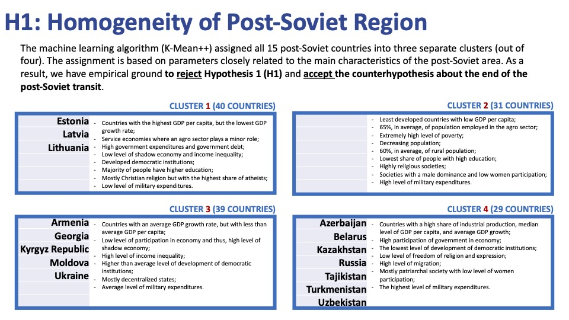

# Does the Post-Soviet Space Still Exist? 
## An Unsupervised Machine Learning Approach to Classifying Countries according to Specific Economic and Political Characteristics
ONGOING RESEARCH (LAST UPD MARCH 2022)

# Intro 
The upcoming 30th anniversary of the 1991 Belavezha Accords is again attracting the attention of researchers and policymakers to the topic of the post-Soviet transformation. The question about the consistency of this region’s characteristics compared to other countries and regions or their conceptual differences, based on the theory of institutional change and persistence, is still not fully answered. Benefiting from available open-source data and machine learning (ML) algorithms, I propose to take a new look at this question.

# Methodology
The application of ML algorithms (particularly the unsupervised ML approach) remains scarce in social sciences, even though it has become technically available and can produce unique and accurate information for further in-depth analysis. With publicly available country-level data, I aim to build an ML algorithm to cluster countries in groups with shared characteristics in different fields – from society to economics to domestic and international politics. By doing so, I will identify hidden and previously unseen structures in the existing data.

If the ML algorithm classifies all or most of the post-Soviet states into a separate group(s), we will have solid empirical grounds to continue applying the concept of the post-Soviet states in social science research and in applied analysis. If, however, the findings are different, we will get a factual confirmation of the increasingly popular argument about the end of the post-Soviet transit. In other words, **the hypothesis 1 (H1) is that the Post-Soviet Space Still Exists.**

Also, I am going to test another **hypothesis (H2) that the Post-Soviet space is homogeneous.** If the Silhouette coefficients do not allow to choose different clusters when we apply the ML algorithm to only 15 post-Soviet states, I will accept the H1. If instead there are be different clusters among 15 post-Soviet states, defined by the K-Mean+ algorithm, the H1 will be rejected.

In any way, the findings will register a data-driven opening of new avenues for research in area studies (post-Soviet studies), transition studies, and IR/geopolitical studies. Yet, it is noteworthy that the algorithmic cluster analysis is not about answering research questions, but about finding new relationships and insights, often not visible through other methods of data investigation.

# Results

The post-Soviet space does not exist any more. 

The post-Soviet space is not homogeneous.

Russia is on the edge between Westernized and Conservative groups.

# Analysis

# What's next

